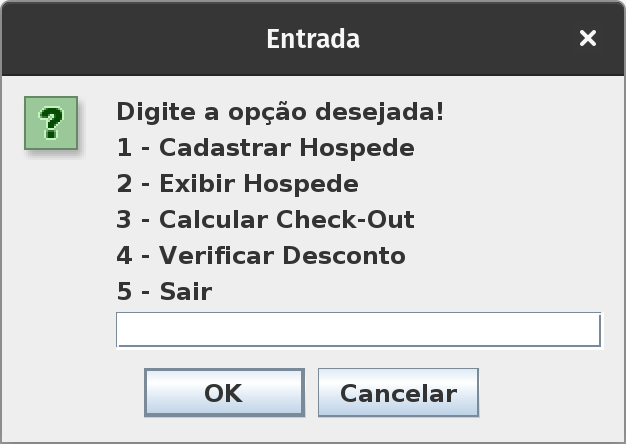

<h1 align="center"> Hospedagem </h1>

Projeto sobre uma programa para cadastrar hospedes.  

  <a href="#-tecnologias">Tecnologias</a>&nbsp;&nbsp;&nbsp;|&nbsp;&nbsp;&nbsp;
  <a href="#-projeto">Projeto</a>&nbsp;&nbsp;&nbsp;|&nbsp;&nbsp;&nbsp;
  <a href="#memo-licença">Licença</a>

  

 

  

## 🚀 Tecnologias

Esse projeto foi desenvolvido com as seguintes tecnologias:

- Java
- Github
- NetBeans

## 💻 Projeto

Um programa sobre cadastro com foco em JOption

## :memo: Licença

Esse projeto está sob a licença MIT.
